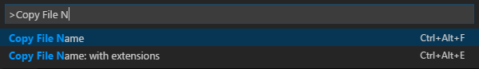

# copy-file-name

Copies the name of the currently active file to the clipboard.

## Features

* `Ctrl-Alt-f` / `Cmd-Alt-f` - copies the name of currently active file **without extension**
* `Ctrl-Alt-e` / `Cmd-Alt-e` - copies the name of currently active file **with extension**

## Dependencies

-

## Known Issues

- 

## Release Notes

### 1.2.0

* Remove the dependency on `node-copy-paste` and use the built in Clipboard support in VS Code 1.30.x and above.

### 1.1.0

* The Copy commands are included in the editor title and Explorer context menus 

### 1.0.0

* Initial release

# License

[MIT](LICENSE) &copy; Viktor Nemes
